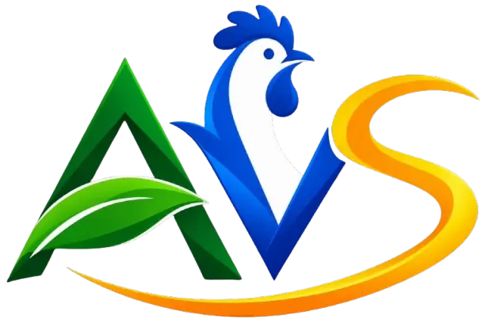

<div align="center">



# AGRO VÉTO SERVICES CONGO (A.V.S.)

**Clinique Vétérinaire 24/7 · Provenderie Certifiée · Poussins Cobb 500 · Formations & QHSE**

Pointe-Noire, République du Congo 🇨🇬 — Sous la direction du **Dr Marie-Rose Edwige Rakié POUTYA SAIZONOU**

[](https://agrovetoservices.cg)
[](https://nextjs.org)
[](https://reactjs.org)
[](https://gsap.com)
[](https://threejs.org)
[](https://www.framer.com/motion)
[](https://prisma.io)

</div>

---

## 📖 À propos

**Agro Véto Services Congo (A.V.S.)** est une entreprise de référence en République du Congo et en Afrique Centrale, spécialisée dans :
1. **Clinique Vétérinaire & Soins d'Urgence 24h/24 & 7j/7** : Chirurgie, hospitalisation, vaccination, pharmacie vétérinaire.
2. **Provenderie Industrielle Certifiée** : Aliments équilibrés pour volailles (démarrage, croissance, finition), porcs, bovins et petits ruminants.
3. **Poussins d'un jour Cobb 500** : Vigueur hybride, traçabilité sanitaire, fort taux de conversion alimentaire.
4. **Audit QHSE & Biosécurité (HACCP / ISO 22000)** : Accompagnement qualité des élevages et des industries agroalimentaires.
5. **Formations Pratiques & Fermes-Écoles** : Transfert de compétences et professionnalisation des éleveurs.
6. **Cosmétique & Hygiène Animale** : Produits de soins, désinfection et biosécurité.

---

## 🛠️ Stack Technique

| Composant | Technologie |
|---|---|
| **Framework** | Next.js 14.2 (App Router) |
| **Interface & Animations** | React 18, GSAP, Framer Motion, Three.js (WebGL Shaders) |
| **Design System** | Vert Treillis (`#5a8738`), Dark/Light mode avec View Transitions |
| **ORM & Base de Données** | Prisma ORM + PostgreSQL |
| **Assistant IA** | Google Gemini API (avec fallback Groq Llama 3.1) |
| **Dashboard & Facturation** | Tableau de bord interne `/dashboard`, génération de devis/factures PDF |

---

## 🚀 Démarrage en local

```bash
# Installation des dépendances
npm install

# Lancement du serveur de développement (port 3002)
npm run dev

# Accès au site public
http://localhost:3002

# Accès au Dashboard Administrateur
http://localhost:3002/dashboard
# Identifiants par défaut : admin / admin
```

---

## 📍 Contact & Siège

- **Siège & Clinique** : Socoprise, Pointe-Noire, République du Congo
- **Site Web** : https://agrovetoservices.cg
- **Direction** : Dr Marie-Rose Edwige Rakié POUTYA SAIZONOU

*© Agro Véto Services Congo — Tous droits réservés.*
